<div align="center">
  <a href="https://github.com/ErWawa">
    
  </a>

  <br />

  

  <p>
    <a href="https://github.com/ErWawa?tab=repositories"></a>
    <a href="https://github.com/ErWawa?tab=followers"></a>
  </p>
</div>

## &gt; whoami

I’m **ErWawa**, a builder focused on the space where software, artificial intelligence, and immersive interfaces meet.

I enjoy turning ambitious ideas into systems that can actually run: local-first AI, voice interfaces, automation, knowledge tools, and visual experiences with a strong sense of identity.

```text
focus = ["AI systems", "automation", "voice", "3D interfaces", "knowledge tools"]
principles = ["make it useful", "keep it understandable", "ship the real thing"]
```

## What I build

- AI systems with practical interfaces and clear feedback.
- Voice, vision, and automation tools that connect naturally to everyday workflows.
- Knowledge and memory systems that keep context useful and inspectable.
- Dark, information-rich interfaces where every visual element communicates state.

## The stack I reach for

<div align="center">


</div>

## How I work

- **Systems over snippets.** A feature is finished when it connects cleanly to the rest of the system.
- **Visuals with a job.** The interface should communicate state, not just look futuristic.
- **Local-first when possible.** Privacy, inspectability, and control matter.
- **Small feedback loops.** Build, test, observe, refine.
- **Curiosity with a delivery instinct.** Explore widely, then make one useful thing real.

## Find me in the signal

<div align="center">
  <a href="https://github.com/ErWawa"></a>
  <a href="https://github.com/ErWawa?tab=repositories"></a>
</div>

<div align="center">
  
</div>

<div align="center">
  
</div>

<br />

<div align="center">
  <sub>— build something worth remembering —</sub>
</div>
